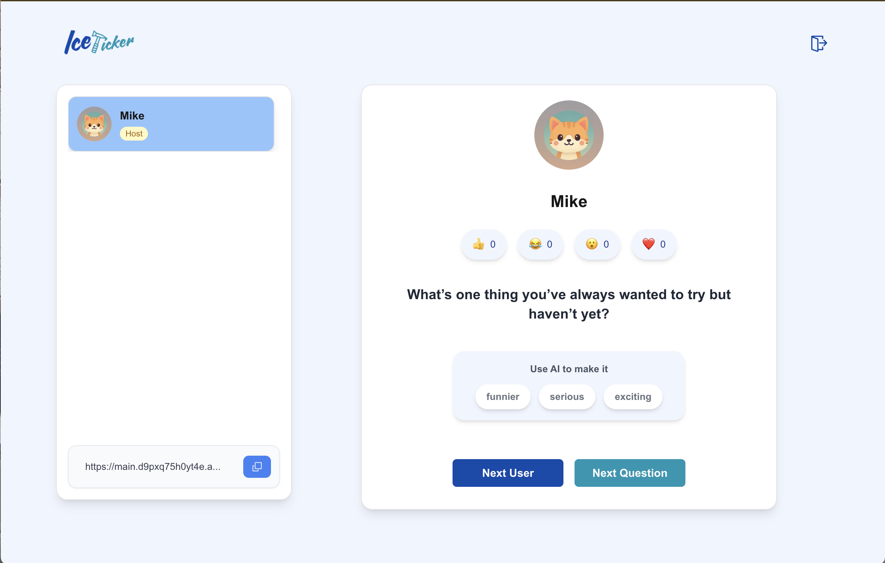
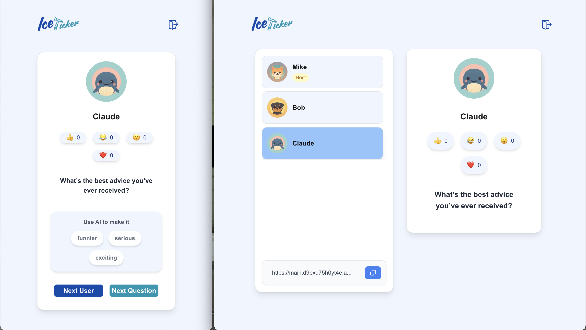
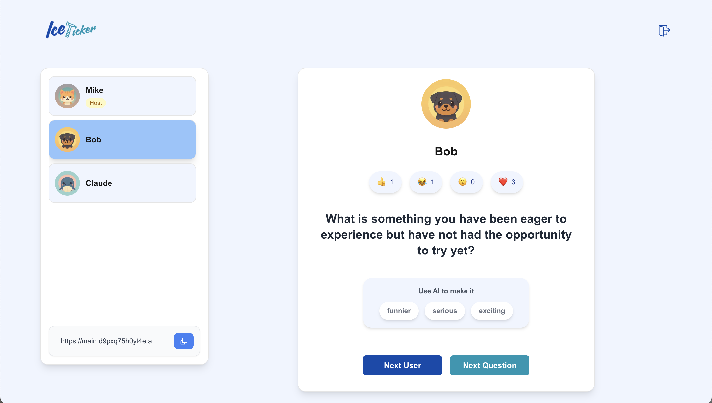
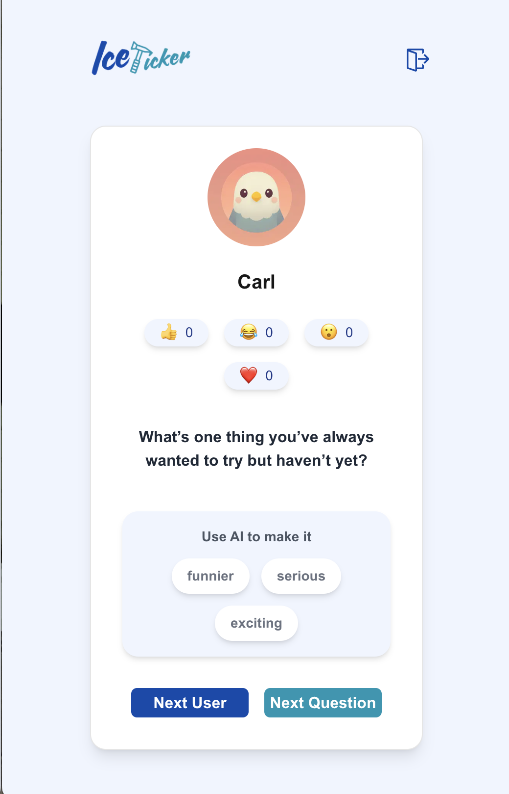

# Icepicker

**Icepicker** is a game designed to break the ice in dynamic group settings. The first user creates a room and can share a link for others to join. This user, known as the *host*, can cycle through questions and use AI to adjust their tone — making them funnier, more serious, or more exciting. The host can also select which user will answer the question. If the host leaves the session, the next user in line automatically becomes the new host.

👉 [Live Demo](https://main.d9pxq75h0yt4e.amplifyapp.com)

## 🧱 Architecture

This project was built as a **full-stack app**, following a monolithic architecture, where the frontend (React) and backend (Node.js + PostgreSQL) share the same repository and runtime structure. This approach simplifies local development and deployment, which was done in AWS using EC2 and Amplify.

- [Frontend (React + Redux + Tailwind)](./client/README.md)
- [Backend (Node.js + Prisma + PostgreSQL)](./backend/README.md)

### Screenshots

**Home Page**  	                            |**Users** 
:------------------------------------------:|:-----------------------------------------:
     |
:------------------------------------------:|:-----------------------------------------:
**Questions**  	                            |**Mobile**
|

## Getting Started

See the README.md instructions for both the `client` and the `backend`. 

## Areas for Improvement

While I’m proud of this project, I recognize that its growing complexity can be overwhelming at times. After stepping away for a few days, it’s easy to lose track of some of the internal logic. This occasionally slowed down development. With hindsight, I believe I could have implemented some parts using simpler or more efficient logic to better follow the principle of minimal effort.
