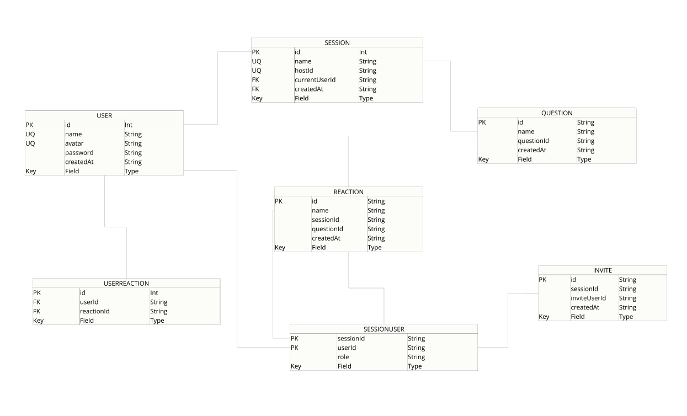

> 📌 This backend is part of a monolithic full-stack project. For an overview of the full architecture, see the [main README](../README.md).


## Getting Started

To run the project locally:

```bash
npm install  
npm run dev
```

## Environment Variables

DATABASE_URL=

OPENAI_API_KEY=

PORT=
NODE_ENV=

OWN_ORIGIN = as frontend URL

# Backend

This project uses **Prisma ORM** with **PostgreSQL** to manage the backend and database. The data model was built with extensibility in mind — for instance, it includes a `password` field, enabling future iterations with user authentication and account creation.

**Prisma Model**  	            | **Data Flow**
:------------------------------:|:------------------------------:
 | 

To enable real-time communication, the application integrates **WebSockets**. It also features an **AI-powered system** that rewrites questions dynamically based on user preferences.

The entire backend is deployed on **AWS**, with **Nginx** configured as a reverse proxy to ensure high performance in production.

