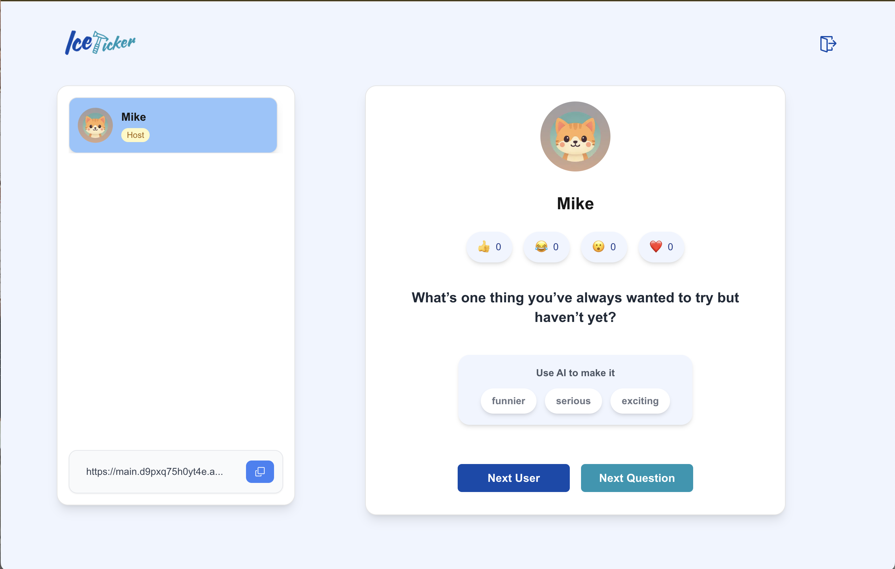
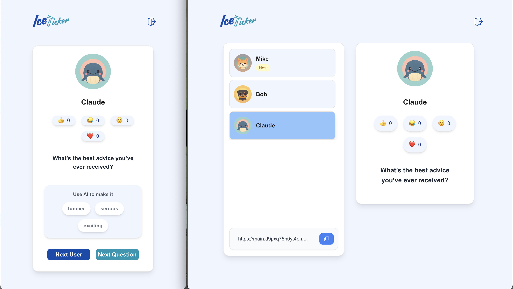
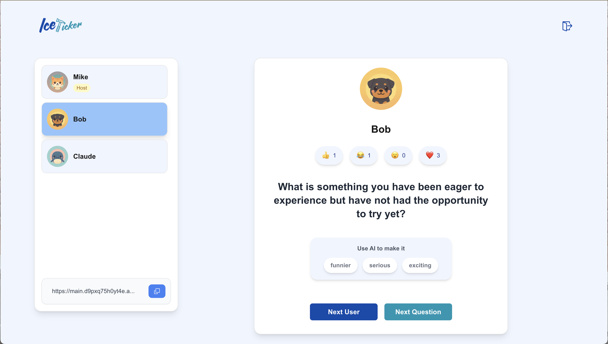

# Icepicker

**Icepicker** is a game designed to break the ice in dynamic group settings. The first user creates a room and can share a link for others to join. This user, known as the *host*, can cycle through questions and use AI to adjust their tone — making them funnier, more serious, or more exciting. The host can also select which user will answer the question. If the host leaves the session, the next user in line automatically becomes the new host.

👉 [Live Demo](https://main.d9pxq75h0yt4e.amplifyapp.com)

### Screenshots

**Home Page**  	                |**Users** 
:------------------------------:|:-------------------------------:
|
:------------------------------:|:-------------------------------:
**Questions**  	
	


## Getting Started

To run the project locally:

```bash
npm install  
npm run dev
```
Then open http://localhost:3000 in your browser.


## Technical Notes

It’s a **monolith**, built entirely from scratch and deployed on **AWS**. This project leverages modern web technologies, including:

- **Redux Toolkit** for state management  
- **Tailwind CSS** for layout and styling  
- Additional components styled with **Emotion** and **Material UI**  
- **Prisma ORM** with **PostgreSQL** for the backend and database  

The data model was designed with extensibility in mind — for example, including a password field to enable account creation in future iterations.

To support real-time interactions, the app uses **WebSockets**. **AI** is integrated to dynamically rewrite questions based on user preferences. The entire application is deployed on AWS.

## Areas for Improvement

While I’m proud of this project, I recognize that its growing complexity can be overwhelming at times. After stepping away for a few days, it’s easy to lose track of some of the internal logic. This occasionally slowed down development. With hindsight, I believe I could have implemented some parts using simpler or more efficient logic to better follow the principle of minimal effort.
